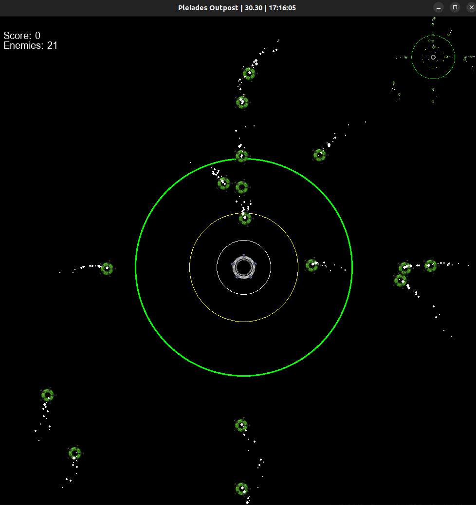

<div align="center">
    
    
</div>

<div align="center">
<h3>V.0.2</h3>

</div>

<br>

# Pleiades Outpost

O posto avançado das Pleiades é um jogo do gênero **Tower Defense** no estilo espaço, cujo obtivo é **defender a base de naves inimigas** enquanto acumula pontos e se desenvolve.


## Resumo
- [Pleiades Outpost](#pleiades-outpost)
  - [Resumo](#resumo)
  - [Requisitos](#requisitos)
  - [Ambiente](#ambiente)
  - [Iniciar o Jogo](#iniciar-o-jogo)
  - [Estrutura](#estrutura)
  - [Créditos](#créditos)


## Requisitos
- Git
- Python 3.10
- Pygame 2.1.2
- Virtualenv *ou semelhante*
- Um editor de códigos como VSCode, Sublime, Vim, Pycharm, etc...

> **Opicional**  -> blue 0.9.1  *Para formatar o codigo com flake8*

> **O .vscode** já possue configuração para auto formatação do flake8, portanto use o blue para complementar.

## Ambiente
Crie o ambiente virtual

```console
virtualenv .venv
```

Ative o ambiente 

```console
# Linux Bash
source .venv/bin/activate
# Windows Power Shell
./.venv/bin/activate.ps1
```

Instale as dependências

```console
pip install -r requirements.txt
```

## Iniciar o Jogo

```console
python main.py
```

## Estrutura

```console
.
├── docs
│   ├── img
│   │   ├── v.0.1.png
│   │   └── v.0.2.png
│   ├── README.md
│   └── tasks.md
├── main.py
├── requirements.txt
├── src
│   ├── enemy
│   │   ├── entity.py
│   │   └── particles.py
│   ├── game.py
│   ├── layout
│   │   └── layout.py
│   └── player
│       └── entity.py
└── static
    ├── image
    │   ├── credit.txt
    │   ├── nave1.png
    │   └── nave2.png
    └── soundtrack
        ├── credit.txt
        └── main.mp3

9 directories, 16 files
```

## Créditos

- [Soundtrack](/static/soundtrack/credit.txt)
- [Sprites](/static/image/credit.txt)